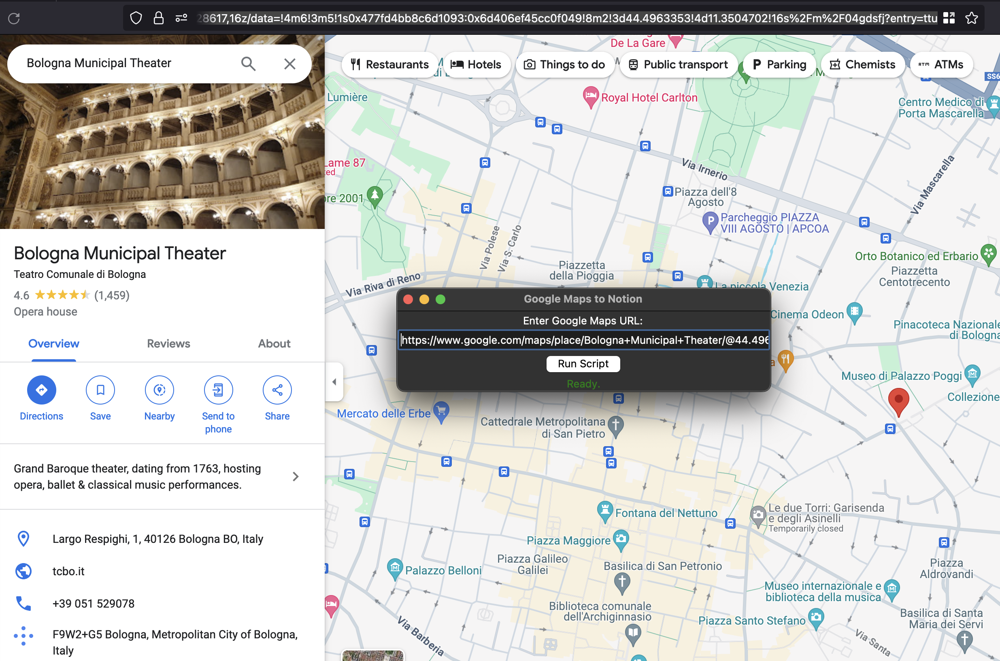
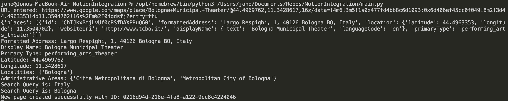
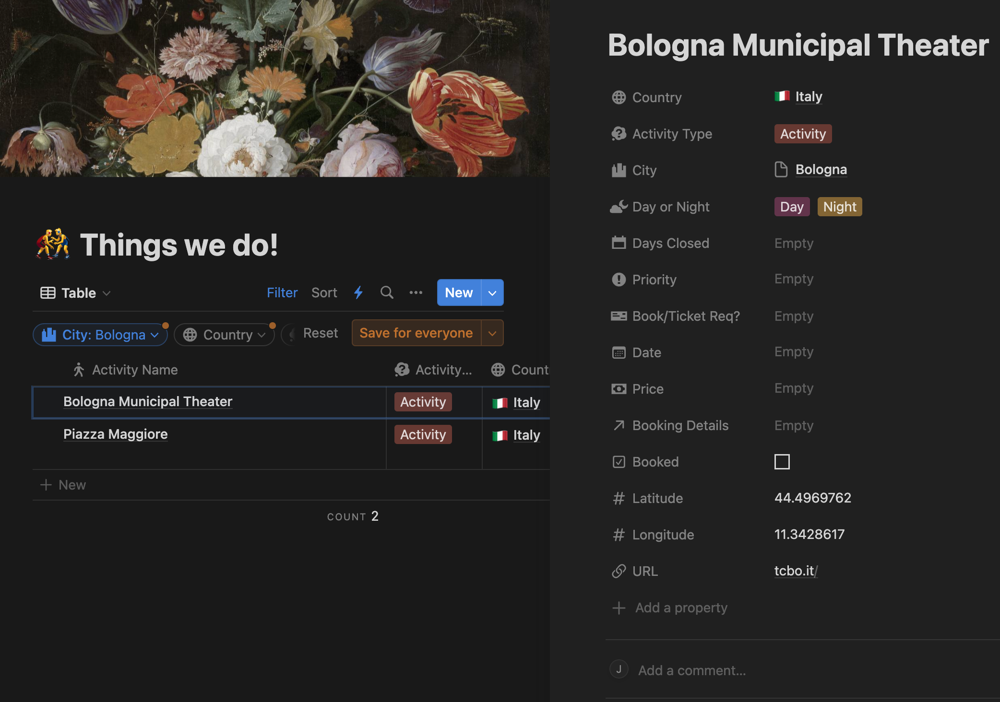

# NotionIntegration

A Python application designed to integrate Google Maps data into Notion databases. This tool automates the process of extracting detailed information from Google Maps URLs (e.g., place names, coordinates, opening hours) and creates or updates corresponding entries within a Notion database. It is particularly useful for travel planning and managing geolocation-based data directly within Notion.

---

## Features

- **Google Maps Data Extraction**
  - Automatically extracts detailed information from Google Maps URLs, including:
    - Place names
    - Geographic coordinates (latitude and longitude)
    - Opening hours
    - Website URLs

- **Notion Database Integration**
  - Creates or updates Notion database pages with extracted data, ensuring efficient organization within your workspace.

- **GUI**
  - Provides a simple and intuitive graphical interface, making it accessible to users of all technical backgrounds.

- **Flexible Data Handling**
  - Supports a variety of data types and structures from Google Maps to ensure robust integration with Notion.

---

## Installation

1. Clone the repository:
   ```bash
   git clone https://github.com/MassoniMacaroni/NotionIntegration.git
   cd NotionIntegration
   ```

2. Install the required dependencies:
   ```bash
   pip install -r requirements.txt
   ```

3. Set up environment variables:
   - Create a `.env` file in the project directory with the following keys:
     ```env
     NOTION_API_KEY=your_notion_api_key
     GMAPS_API_KEY=your_google_maps_api_key
     ```

---

## How It Works

1. **Input Google Maps URL**:
   - Enter the Google Maps URL of a location into the GUI.
     

2. **Data Extraction**:
   - The app extracts detailed information from the URL using the Google Maps API.
     

3. **Notion Update**:
   - Extracted data is sent to Notion via its API to create or update entries in the specified database.
     

4. **User Feedback**:
   - The application provides status updates and error feedback through the GUI.

---

## Usage

1. Launch the GUI application:
   ```bash
   python main.py
   ```

2. Enter a Google Maps URL in the input field and click "Run Script".

3. Monitor the status messages and confirm that the Notion database has been updated successfully.

---

## Script Overview

### Core Scripts

1. **`main.py`**
   - The primary script that:
     - Handles GUI interactions.
     - Extracts data from Google Maps.
     - Communicates with Notion to create or update pages.

2. **`searchNotionCountry.py`**
   - Contains functions to search for existing pages in Notion databases and filter results based on specific criteria.

### Key Functions

- **`extract_details_from_google_maps(google_maps_url)`**
  - Extracts place name, coordinates, opening hours, and website from the provided URL.

- **`search_page_in_notion(search_query, database_id)`**
  - Searches for a page in a specified Notion database by query.

- **`add_page_to_notion(page_details)`**
  - Adds a new page to a Notion database using the provided details.

---

## Requirements

- Python 3.8+
- Google Maps API Key with Places and Geocoding API enabled.
- Notion Integration Token with appropriate database permissions.

---

## Troubleshooting

- **Invalid API Keys**:
  - Verify the keys in your `.env` file.

- **Google Maps Data Missing**:
  - Ensure the URL is a valid Google Maps link and the API key has access to the required Google APIs.

- **Notion Errors**:
  - Check if the Notion Integration Token has the correct permissions.
  - Use the debug output in the terminal to trace issues.

---

For any issues or suggestions, please create an issue in the [GitHub repository](https://github.com/MassoniMacaroni/NotionIntegration/issues).
